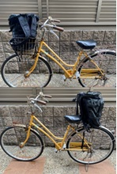
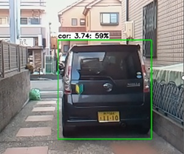

# IoT システム研究室(中本研究室)
## テーマ
研究室の活動テーマはIoTシステムソフトウェアの研究です。IoTシステムはInternet of Thingsの略で, ものがインタネットに繋がっているシステムで、組込みシステムとも呼ばれます。PCの形をしていないコンピュータと思ってもらえればいいです。
スマホやスマートウォッチにようにコンピュータを身に着けて今までないことができる、ロボットや自動車のようにコンピュータが外の世界を制御する等、今までとは違うことが実現できそうです。

これまでやってきた中で分かりやすい研究テーマを紹介します。
* Robocar: Androidタブレットでロボットの車を運転しています。また、ぶつかりそうになるとAndroidウォッチにメッセージが来ます。
[動画](https://drive.google.com/file/d/1NLWYlyRwiBThH9kS02i1niw2sw8a41sL/view?usp=sharing)
* 自転車での危険探知: 自転車で前後の確認をするのが難しい（危険）ということで、自転車の前後を確認して自動車が近づいていたら警告するシステムをラズベリーパイという非常に小型で安価なハードウェアとこうした小型向けのAIライブラリを使って実現しました。

自転車への取り付け

自動車の認識

[研究テーマの詳細](https://github.com/eus-lab/eus)

### 組込みシステムとは

説明を見る

組込みシステムには、小型ハードウェア(省電力CPU、小さいメモリ量、冷却機能なし等)、リアルタイム性能(外が相手のシステムですから待ってくれません。自動車では運転者が障害物を認識してから実際にブレーキを踏むまで300ミリ秒以内と言われています)、場合によっては、途中で不具合があっては困りますから高い信頼性等が要求されます。

私はNECに入社以来、携帯電話のインタネットサービスのiMode Javaアプリ（iアプリ）、携帯電話Linux（今のスマホのさきがけなるようなもの)やICカードソフトウェア、宇宙ステーション用ソフトウェア、自動車ソフトウェアの研究、開発に従事してきました。こうした製品は通常のオフィスで使われるPCとは利用環境が異なり、小型化、リアルタイム性能、高信頼性など特殊な機能が必要で、これらの機能をどう開発しているかが非常にチャレンジングでした。組込みシステムはこれらの製品ソフトウェアは中々一般の方には目につきにくいですが、日本の輸出の半分以上を占めていると言われており。日本の基幹産業を支えています。

## 良い研究をするために：東京科学大学　植松友彦先生[研究読本](http://www.it.ce.titech.ac.jp/uyematsu/howtoresearch.pdf)

前の職場の同僚から紹介してもらいました（栗原先生、感謝します）。皆さんは「研究するの？」と思うかもしませんが、3年次の研究演習、4年次の卒業研究も立派な研究活動です。一読ください(3節の文献の集め方はスキップしてもいいと思います)

## これまでやってきたこと
- [Reseach Map](https://researchmap.jp/read0205040)

- [Google Scholar](https://scholar.google.co.jp/citations?user=-yzL0TsAAAAJ&hl=ja)

- [DBLP](https://dblp.org/pid/95/5961.html)

